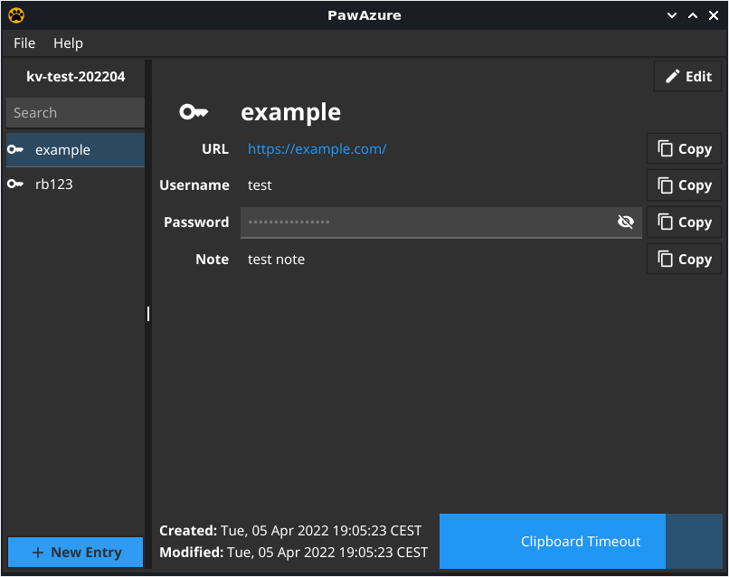

<div align="center">
    
</div>

# Paw Azure Key Vault Client

PawAzure is a **CRUD(Create,Read,Update,Delete) Client** used as front end when interacting with an existing [Azure Key Vault](https://azure.microsoft.com/en-us/services/key-vault/#product-overview).
It is written in Go and uses [Fyne](https://github.com/fyne-io/fyne) as UI toolkit and [Azure SDK for Go](github.com/Azure/azure-sdk-for-go) as the backend to interact with Azure Key Vault.

## Warning

**This software is work in progress, and didn't went through a full security audit.**
**Do not expect it to be bug free and do not rely on it for any type of security.**

## Screenshot

<div align="center">
    
</div>

## Main Goal

Provide User Friendly and intuitive way of sharing passwords between team members or company teams with the required level of granularity provided with RBAC Roles

## Requirements
[Azure Subscription](https://azure.microsoft.com/en-gb/free/)
[Azure AD Application](https://docs.microsoft.com/en-gb/azure/active-directory/develop/quickstart-register-app)
[RBAC Custom Roles](https://docs.microsoft.com/en-gb/azure/role-based-access-control/overview) 
[az cli tool](https://docs.microsoft.com/en-us/cli/azure/)

## Installation
```
go install https://github.com/koceg/pawazure@latest
```

## Configuration
The following steps are provided to create a working environment and some personal preferences that try to make it as secure as possible.
Feel free to ignore if a preconfigured environment already exists.
```bash
# use the following command to list available locations to choose from
az account list-locations --query "[*].name" --out tsv | sort

# create resource group if one does not existent
az group create --location <location> --resource-group <resource-group-name>

# create azure key vault if one does non existent
az keyvault create --resource-group <resource-group-name> \
--name <keyvault-name> --enable-rbac-authorization

# create custom access policy optional
cat << EOF > rbac_keyvault_admin.json
{
  "Name": "KeyVault Admin",
  "IsCustom": true,
  "Description": "Manage every aspect of secrets inside a key-vault except deletion including RBAC access",
  "Actions": [
    "Microsoft.Authorization/*",
    "Microsoft.KeyVault/vaults/secrets/read",
    "Microsoft.KeyVault/vaults/secrets/write",
    "Microsoft.KeyVault/vaults/read",
    "Microsoft.KeyVault/vaults/deploy/action"
  ],
  "NotActions": [],
  "DataActions": [
    "Microsoft.KeyVault/vaults/secrets/getSecret/action",
    "Microsoft.KeyVault/vaults/secrets/setSecret/action",
    "Microsoft.KeyVault/vaults/secrets/readMetadata/action",
    "Microsoft.KeyVault/vaults/secrets/backup/action",
    "Microsoft.KeyVault/vaults/secrets/update/action",
    "Microsoft.KeyVault/vaults/secrets/restore/action"
  ],
  "NotDataActions": [],
  "AssignableScopes": [
    "/subscriptions/<subscriptionID>/"
  ]
}
EOF

# example of read only policy
cat << EOF > rbac_keyvault_read_only.json
{
  "Name": "KeyVault ReadOnly",
  "IsCustom": true,
  "Description": "list and view secrets",
  "Actions": [
    "Microsoft.KeyVault/vaults/secrets/read"
  ],
  "NotActions": [],
  "DataActions": [
    "Microsoft.KeyVault/vaults/secrets/getSecret/action",
    "Microsoft.KeyVault/vaults/secrets/readMetadata/action"
  ],
  "NotDataActions": [],
  "AssignableScopes": [
    "/subscriptions/<subscriptionID>/"
  ]
}
EOF

# Create custom roles optional
az role definition create --role-definition <file.json>

# Get custom roles ( relates to the previous commands )
az role definition list --custom-role-only \
--query "[].{ID:name,Name:roleName,Desc:description}" --output table

```
## Assign Roles

**subcription > resourceGroup > keyvault > secret | ">" denotes scope level**

**NOTE:** to stay in [subscription limits](https://docs.microsoft.com/en-us/azure/role-based-access-control/role-assignments-list-portal#list-number-of-role-assignments) it is wise to group the objects(users,service principles ,etc) on a group/team level
 and grant one permission for them instead of per object policy

```bash
# get data on AD groups and users
az ad user list --query "[].{Member:displayName,ID:objectId}" --output table
az ad group list --query "[].{Group:displayName,ID:objectId}" --output table

az ad group member check --group <ID> --member-id <ID>
az ad group member add --group <ID> --member-id <ID>

# grant RBAC permissions
az keyvault list --query "[].{KeyVault:name,ID:id}" --output table
# RBAC per keyvault
az role assignment create --role <ID> --assignee-object-id <ID(group/user)> \
--assignee-principal-type <Group/User> --scope <ID(keyvault list)>
# RBAC per secret
az role assignment create --role <ID> --assignee-object-id <ID(group/user)> \
--assignee-principal-type <Group/User> --scope <ID(keyvault list)/secrets/secret_name>
```

## Application Registration

We need this so end users are able to authenticate against azure and the appliation needs to be able to impersonate them when acessing the target keyvault
```bash
cat << EOF > keyvault_impersonate.json
[{
    "resourceAppId": "cfa8b339-82a2-471a-a3c9-0fc0be7a4093",
    "resourceAccess": [
        {
            "id": "f53da476-18e3-4152-8e01-aec403e6edc0",
            "type": "Scope"
        }
   ]
}]
EOF

az ad app create --display-name "Key Vault Login" --reply-urls 'http://localhost' \
--native-app --required-resource-accesses keyvault_impersonate.json

#Remove api permissions: disable default exposed scope first
# default oauth parameters enabled when creating new application
default_scope=$(az ad app show --id <appID> | jq '.oauth2Permissions[0].isEnabled = false' | jq -r '.oauth2Permissions')
az ad app update --id <appID> --set oauth2Permissions="$default_scope"
az ad app update --id <appID> --set oauth2Permissions="[]"
az ad app update --id <appID> --set oauth2AllowIdTokenImplicitFlow=false
```
Now it is time to start PawAzure.


## How it works

On the very **First Start** you would be asked for **TenantID** and **ApplicationID**.
This data is saved under *$HOME/.paw/azure.json*
If desired you can configure it manually and skip this initial step
```json
{
    "application_id": "",
    "azure_vaults": [
        "",
        ""
    ],
    "tenant_id": ""
}
```
Once this is done you would be prompted for the keyvault name and redirected to the authentication portal.

**NOTE:** before starting the authentication step make sure you have started your browser,
as currently the application would freeze and break because this process is not handled gracefully.
Also would help in the future authentication(as long as session cookies are not deleted).

After sucessfull authentication the selected keyvault would be loaded in PawAzure.

Now depending on the granted permissions you would be able to execute a subset of the **CRUD** commands.

**NOTE:** PawAzure initially loads only the available meta data for the secrets in the selected keyvault,
meaning we don't load the **secret value** until the moment we need to use it for the first time.

At which point we cache the data in RAM for the duration of the running time of the application.
This would provide access in case of network problems as well as bandwidth reduction.

If you see that secrets are not listed but expected you would need to use the search field and type the exact password name to read it from the keyvault, reason for this would be if the permissions are granted per secret.

### Random passwords

Random passwords are derived reading byte-by-byte the block of randomness from a [HKDF](https://pkg.go.dev/golang.org/x/crypto/hkdf) cryptographic key derivation function that uses the age key as secret. Printable characters that match the desired password rule (uppercase, lowercase, symbols and digits) are then included in the generated password.

### Custom passwords

Where a generated password is not applicable a custom password can be specified. 

### Items

Items are special templates aimed to help the identity management.

Currently the following items are available:

- login  (wrapped [Azure Key Vault secret](https://docs.microsoft.com/en-us/azure/key-vault/secrets/about-secrets))

## Threat model

The threat model of PawAzure assumes there are no attackers on your local machine.

## Costs

the cost for running this setup as is would go as high as ~ 0.03 cent per 10 000 transactions
[Key Vault pricing](https://azure.microsoft.com/en-us/pricing/details/key-vault) for detailed explanation

## Contribute

- Fork and clone the repository
- Make and test your changes
- Open a pull request

## Credits

 - [paw](https://github.com/lucor/paw) for creating the original UI and doing the ground work that served as inspiration
